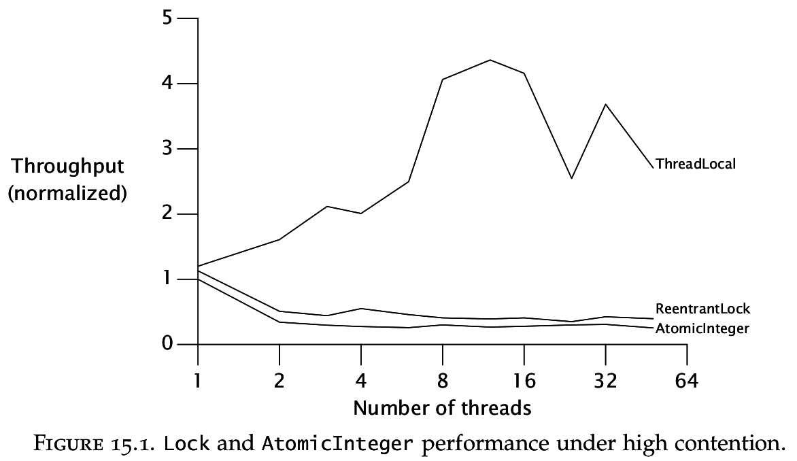
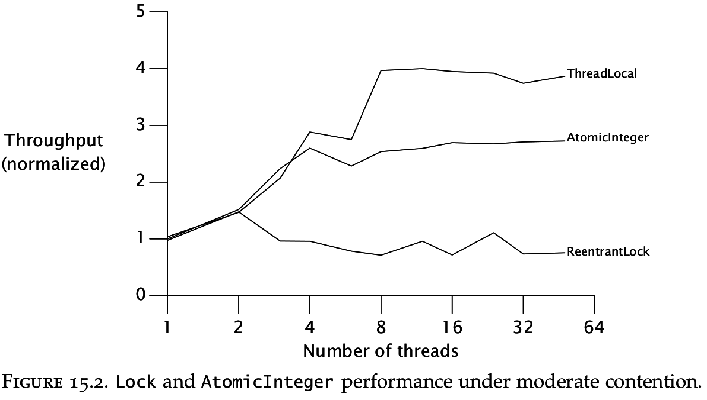

# Variables atómicas

## Material

* [Java theory and practice: Going atomic](http://www.ibm.com/developerworks/library/j-jtp11234/)

## Material adicional

* [Understanding Atomic Operations](https://jfdube.wordpress.com/2011/11/30/understanding-atomic-operations/)
* Capítulo 15 de [Java Concurrency in Practice](https://www.google.com.co/search?q=Java+Concurrency+in+Practice+pdf+download) (Nonblocking Synchronization)

## Resumen puntos importantes

### Disadvantages of locking

> (...) The downside is that if the lock is heavily contended (threads frequently ask to acquire the lock when it is already held by another thread), throughput can suffer, as contended synchronization can be quite expensive. (Public Service Announcement: uncontended synchronization is now quite inexpensive on modern JVMs.)

> Another problem with lock-based algorithms is that if a thread holding a lock is delayed (due to a page fault, scheduling delay, or other unexpected delay), then no thread requiring that lock may make progress.

### Volatile variables

> **Volatile variables** can also be used to store shared variables at a lower cost than that of synchronization, but they have limitations. While writes to volatile variables are guaranteed to be immediately visible to other threads, there is no way to render a read-modify-write sequence of operations atomic, meaning, for example, that a volatile variable cannot be used to reliably implement a mutex (mutual exclusion lock) or a counter.

### Compare And Swap (CAS)

> A CAS operation includes three operands -- a memory location (V), the expected old value (A), and a new value (B). The processor will atomically update the location to the new value if the value that is there matches the expected old value, otherwise it will do nothing. In either case, it returns the value that was at that location prior to the CAS instruction. (Some flavors of CAS will instead simply return whether or not the CAS succeeded, rather than fetching the current value.) CAS effectively says "I think location V should have the value A; if it does, put B in it, otherwise, don't change it but tell me what value is there now."

### Lock-free and wait-free algorithms

> (... about lock-free algorithms) While they are more complicated to implement, they have a number of advantages over lock-based alternatives -- hazards like priority inversion and deadlock are avoided, contention is less expensive, and coordination occurs at a finer level of granularity, enabling a higher degree of parallelism.

### Atomic variable classes

> The atomic variable classes all expose a compare-and-set primitive (similar to compare-and-swap), which is implemented using the fastest native construct available on the platform (**compare-and-swap**, **load linked/store conditional**, or, in the worst case, **spin locks**).

> The atomic variable classes can be thought of as a generalization of volatile variables, extending the concept of volatile variables to support atomic conditional compare-and-set updates. Reads and writes of atomic variables have the same memory semantics as read and write access to volatile variables.

> Nearly all the classes in the `java.util.concurrent` package use atomic variables instead of synchronization, either directly or indirectly. Classes like `ConcurrentLinkedQueue` use atomic variables to directly implement wait-free algorithms, and classes like `ConcurrentHashMap` use `ReentrantLock` for locking where needed. `ReentrantLock`, in turn, uses atomic variables to maintain the queue of threads waiting for the lock.

### The ABA Problem

> Because CAS basically asks "is the value of V still A" before changing V, it is possible for a CAS-based algorithm to be confused by the value changing from A to B and back to A between the time V was first read and the time the CAS on V is performed. In such a case, the CAS operation would succeed, but in some situations the result might not be what is desired. This problem is called the ABA problem, and is generally dealt with by associating a tag, or version number, with each value to be CASed, and atomically updating both the value and the tag. The `AtomicStampedReference` class provides support for this approach.

## Notas sobre el capítulo 15 de Java Concurrency in Practice

### Pesimistic vs Optimistic approach

> Exclusive locking is a **pessimistic** technique—it assumes the worst (if you don’t lock your door, gremlins will come in and rearrange your stuff) and doesn’t proceed until you can guarantee, by acquiring the appropriate locks, that other threads will not interfere.

> For fine-grained operations, there is an alternate approach that is often more efficient—the **optimistic** approach, whereby you proceed with an update, hopeful that you can complete it without interference. This approach relies on collision detection to determine if there has been interference from other parties during the update, in which case the operation fails and can be retried (or not).

### About CAS

> When multiple threads attempt to update the same variable simultaneously using CAS, one wins and updates the variable’s value, and the rest lose. **But the losers are not punished by suspension, as they could be if they failed to acquire a lock; instead, they are told that they didn’t win the race this time but can try again**.

The typical pattern for using CAS:

* Read the value A from V
* Derive the new value B from A
* Use CAS to atomically change V from A to B so long as no other thread has changed V to another value in the meantime.

### An atomic counter

```java
@ThreadSafe
public class CasCounter {
  private SimulatedCAS value;

  public int getValue() {
    return value.get();
  }

  public int increment() {
    int v;
    do {
      v = value.get();
    }
    while (v != value.compareAndSwap(v, v + 1));
    return v + 1;
  }

}
```

> (...) CAS-based counters significantly outperform lock-based counters if there is even a small amount of contention, and often even if there is no contention. The fast path for uncontended lock acquisition typically requires at least one CAS plus other lock-related housekeeping, so more work is going on in the best case for a lock-based counter than in the normal case for the CAS-based counter.

### _Performance_ con contención alta

> As these graphs show, at high contention levels locking tends to outperform atomic variables, but at more realistic contention levels atomic variables outperform locks.



### _Performance_ con contención moderada

> In practice, atomics tend to scale better than locks because atomics deal more effectively with typical contention levels.



> We can improve scalability by dealing more effectively with contention, but true scalability is achieved only by eliminating contention entirely.

### _Nonblocking algorithms_

> An algorithm is called **nonblocking** if failure or suspension of any thread cannot cause failure or suspension of another thread

> (...) an algorithm is called lock-free if, at each step, some thread can make progress.

> Algorithms that use CAS exclusively for coordination between threads can, if constructed correctly, be both nonblocking and lock-free. An uncontended CAS always succeeds, and if multiple threads contend for a CAS, one always wins and therefore makes progress.

### _A nonblocking stack_

> The key to creating nonblocking algorithms is figuring out how to limit the scope of atomic changes to a single variable while maintaining data consistency.

## Ejemplo

El siguiente es un ejemplo que usa una variable atómica pero tiene una condición de carrera:

```java
AtomicInteger atom = ...;
int value = atom.get();
if(value % 2 == 0) {
  atom.set( value / 2 );
} else {
  atom.set( 3 * value + 1 );
}
```

En cambio se debe usar el método `compareAndSet`:

```java
AtomicInteger atom = ...;
int currentValue,newValue;
do {
  currentValue = atom.get();
  if(currentValue % 2 == 0) {
    newValue = currentValue / 2 ;
  } else {
    newValue = 3 * currentValue + 1 ;
  }  
} while(!atom.compareAndSet(currentValue, newValue))
```

O equivalentemente aprovechando la nueva función `updateAndGet` y los lambdas de Java 8:

```java
AtomicInteger atom = ...;
atom.updateAndGet( currentValue -> {
  int newValue;
  if(currentValue % 2 == 0) {
    newValue = currentValue / 2 ;
  } else {
    newValue = 3 * currentValue + 1 ;
  }
  return newValue;
});
```

### En Futuros y Promesas

¿Qué pasa si se llama al mismo tiempo dos funciones que agregan un _callback_ sobre un Futuro? Por ejemplo en el siguiente código se le están agregando dos _callbacks_ al futuro `future1`, potencialmente al mismo tiempo:

```scala
val future1: Future[Int] = ...
val future2: Future[Int] = ...
val future3: Future[Int] = ...

val future4 = future2.flatMap { x => future1.map { y => x + y } }
val future5 = future3.flatMap { z => future1.map { y => z * y } }
```

¿Cómo maneja esto la implementación?

¿Que pasa si una promesa se completa al mismo tiempo que se le está agregando un _callback_? ¿Que condiciones de carrera se podrían dar? ¿Como evita esto la implementación?
